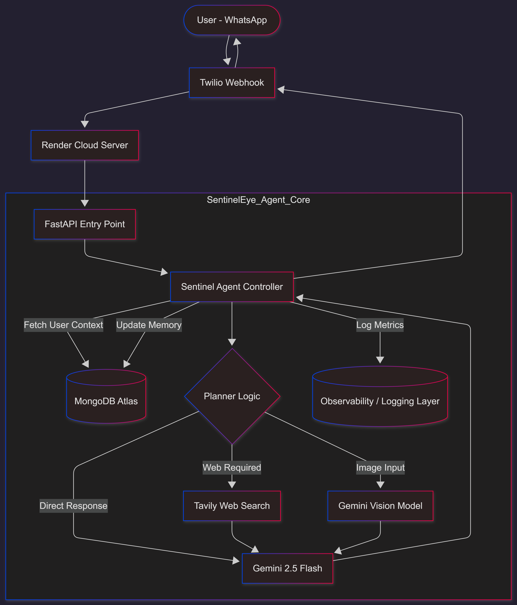

# 👁️ SentinelEye: Autonomous AI Agent


> **SentinelEye is not just a bot; it's a thinking Agent.**
> Unlike traditional chatbots that follow fixed rules, SentinelEye uses an **LLM-based Planner** to decide *when* to search the web, *when* to use vision, and *how* to remember user details long-term.

---

## 🧠 Core Capabilities

### 1. **Autonomous Planning (The Brain)**

SentinelEye doesn't blindly answer. It evaluates every request:

- **Planner:** Decides if a tool (Search/Vision) is needed or if it can answer from memory.
- **Query Rewriter:** Converts vague user queries (e.g., *"Iska price kya hai?"*) into optimized search queries (e.g., *"Current price of Ford Mustang Shelby GT500 in 2026"*) using conversation history.

---

### 2. **Infinite Contextual Memory**

- **Architecture:** Uses **MongoDB Atlas** to store conversation history.
- **Isolation:** Supports multi-tenancy. Each WhatsApp user (Phone Number) has a unique, isolated memory stream.
- **Persistence:** Remembers details from days or months ago.

---

### 3. **Advanced Tool Use**

- **🔍 Deep Web Search:** Integrated with **Tavily API** for real-time, factual information retrieval.
- **👁️ Computer Vision:** Can analyze images sent via WhatsApp using Gemini Vision.

---

### 4. **Production Ready Infrastructure**

- **Async Core:** Built on **FastAPI** & **Motor** (Async Mongo Driver) for high concurrency.
- **Dockerized:** Fully containerized for easy deployment on Render, Railway, or AWS.
- **Resilient:** Includes structured error handling and logging.

---

## 🏗️ System Architecture



> **Flow:** The system listens for WhatsApp messages via **Twilio Webhook**. The request is routed to the **FastAPI** server on Render. The **Agent Core** retrieves user context from **MongoDB**, plans the best action (Web Search or Vision), and generates a response using **Gemini 2.5 Flash** before sending it back to the user.

---

## 🏆 Competitive Advantage

| Feature | Standard Chatbot ❌ | SentinelEye (Agent) ✅ |
| :--- | :---: | :---: |
| **Decision Making** | Rules / Keywords | **Autonomous Planner (LLM)** |
| **Memory** | Session only (Forgets on restart) | **Infinite Persistent Memory (MongoDB)** |
| **Vision** | None | **Gemini Multi-modal Vision** |
| **Search** | Static / None | **Deep Web Search (Tavily)** |
| **Infrastructure** | Simple Script | **Async FastAPI + Docker (Scalable)** |

---

## 🛠️ Tech Stack

| Component | Technology | Description |
| :--- | :--- | :--- |
| **Orchestrator** | Python 3.11 | Core logic & Flow control |
| **API Framework** | FastAPI | High-performance Webhook handler |
| **LLM Brain** | Google Gemini 2.5 Flash | Reasoning, Planning & Generation |
| **Database** | MongoDB Atlas | Long-term JSON Memory Storage |
| **Search Engine** | Tavily AI | Optimized Search for AI Agents |
| **Deployment** | Docker & Render | Cloud Hosting & Containerization |

---

## 🚀 Installation & Setup

Follow these steps to set up SentinelEye on your local machine.

### Prerequisites

- Python 3.10 or higher
- MongoDB Atlas Account (Free Tier)
- API Keys:
  - Google AI Studio
  - Tavily
  - Twilio (for WhatsApp)

---

### 1. Clone the Repository

```bash
git clone https://github.com/R-Roy03/SentinelEye_Agent.git
cd SentinelEye_Agent
```

---

### 2. Environment Configuration

Create a `.env` file in the root directory and add your credentials:

```ini
GEMINI_API_KEY=your_gemini_api_key_here
TAVILY_API_KEY=your_tavily_api_key_here
MONGO_URI=your_mongodb_connection_string
PORT=8000
```

---

### 3. Run Locally

It is recommended to use a virtual environment.

#### Windows

```bash
python -m venv venv
venv\Scripts\activate
pip install -r requirements.txt
python main.py
```

#### Linux / Mac

```bash
python3 -m venv venv
source venv/bin/activate
pip install -r requirements.txt
python3 main.py
```

Server will start at:

```
http://localhost:8000
```

---

### 4. Run with Docker (Optional)

```bash
docker build -t sentineleye .
docker run -p 8000:8000 --env-file .env sentineleye
```

---

## 📂 Project Structure

```
SentinelEye_Agent/
├── agent/
│   ├── agent.py
│   ├── planner.py
│   ├── query_rewriter.py
│   └── state.py
├── llm/
│   └── gemini_client.py
├── tools/
│   ├── web_search.py
│   ├── image_gen.py
│   └── pdf_reader.py
├── main.py
├── Dockerfile
└── requirements.txt
```

---

## 🛡️ Future-Proofing

This project includes a frozen `requirements.txt` to ensure stability.  
If you return after weeks or months, simply run:

```bash
pip install -r requirements.txt
```

---

## 📜 License

This project is licensed under the MIT License.

---

## 👤 Author

**Rakesh Raushan**

- **Role:** AI Systems Architect  
- **Focus:** Building Autonomous Agents & Large Scale Systems  

---

*Built with ❤️ by Rakesh Raushan*
